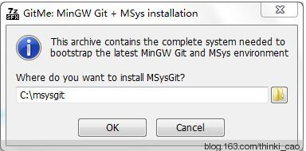
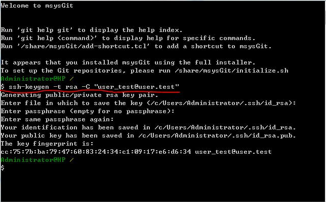

# gitlab

[installl](https://docs.gitlab.com/omnibus/docker/)

## Windows下Git配置与使用指南 Gitlab

* [安装msysGit](#安装msysGit)
* [访问](#访问)
* [拷贝ssh公钥到服务器](#拷贝ssh公钥到服务器)
* [仓库管理](#仓库管理)
* [使用makedown编辑](#使用makedown编辑)

### 安装msysGit

  下载软件[msysGit](Source/msysGit-fullinstall-1.9.0-preview20140217.exe)

  打开之后设置安装路径，默认为C:\msysgit，如图：  
    

  点击“OK”以后开始安装，首先将文件解压到安装目下，然后会自动开始编译，编译结束之后，若看到与下图中类似的内容，则表明编译成功。

  

### 访问

  访问网站`http://10.240.3.82:8088`  
  账号：姓名拼音  
  初始密码：Autel123456

### 拷贝ssh公钥到服务器

> 生成钥匙对

  本地现在运行`C:\msysgit\msysgit\msys.bat`，并执行以下命令`ssh-keygen -t rsa -C "user_test@user.test"`，如图：

  

> 拷贝  

  密钥生成成功！密钥分成两个文件，一个私钥（id_rsa）、一个公钥（id_rsa.pub）。私钥保存在你的电脑上，公钥添加到服务器上。用户必须拥有与服务器公钥所配对的私钥，才能访问服务器上的代码库。

  

### 仓库管理

  clone:`git clone ssh://git@10.240.3.82:2222/root/TechnologyShare.git`  
  更新:`git pull`  
  提交:`git add .`, `git commit -m"update"`, `git push origin master`  
  详情见[git使用说明](git使用说明.md)

### 使用makedown编辑

  [makedown文档](https://guides.github.com/features/mastering-markdown/)
